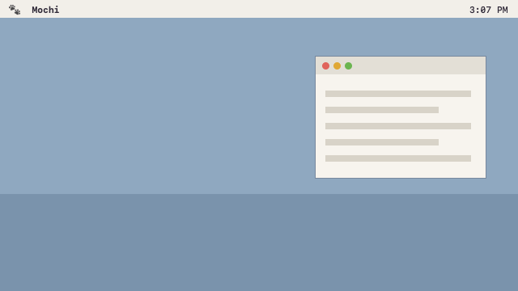
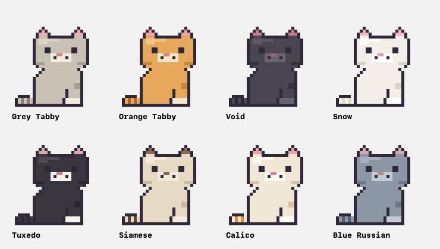

# CursorCat 🐾

A pixel cat (or several) that lives on your Mac. He walks along the bottom of your screen, rides on top of your windows, climbs the walls, hangs from your menu bar — and he has opinions about your files, your apps, and especially your cursor.

<!-- RECORD A GIF AND PUT IT HERE — this is the whole sales pitch.
     20 seconds of: tongue-eating the cursor, rainbow zoomies, trash run, cat pile. -->




## What he does

**On his own**
- roams everywhere: screen bottom, tops of your app windows (he rides them when you drag them), up the screen edges, upside-down along the menu bar
- pounces on your cursor, and sometimes curls up and naps *on* it — a tiny cat riding your pointer until you click to shake him out
- rainbow zoomies 🌈, sudden naps, window-watching, judging whatever app you just opened
- occasionally shoots out a huge tongue, **eats your actual cursor**, chews smugly for three seconds, and spits it back
- sniffs new files that land on your Desktop and digs up old ones you forgot about
- friends visit sometimes. they don't stay. your cats do.

**With you**
- **drop a file on him** → he holds it in his paws; drag it back out into any app or folder later, or click it to open it. a living clipboard
- **double-click him** → type "math notes pdf" → he digs up the best match via Spotlight and holds it out
- **Treat Box** (right-click) → your cursor becomes a snack. fish, biscuit and water go down well. chocolate and lemon are… mistakes
- **drag & fling him.** he splats. he forgives
- add up to 15 permanent cats in 8 coats, or pixel-paint your own in the built-in editor (Cats → Add a Cat → Draw Your Own…)

## Install

Requirements: **Apple Silicon Mac (M1 or newer), macOS 14+**

1. Download `CursorCat.zip` from [Releases](../../releases), unzip, drag `CursorCat.app` wherever you like
2. **First launch will be blocked** (the app is unsigned — no $99 Apple certificate here). Double-click it once, then go to **System Settings → Privacy & Security**, scroll down, and click **Open Anyway**. That's a one-time thing.
   - terminal alternative: `xattr -cr /path/to/CursorCat.app`
3. On first run macOS asks for **Desktop folder access** — that's for the file-sniffing features. The first time you use a Finder feature it asks to **control Finder**. Both are expected; nothing leaves your machine.

No Dock icon — look for **🐾 in your menu bar**. Quit from there too.

## Build from source

```
git clone <this repo>
cd cursor-cat
bash make_app.sh
open CursorCat.app
```

Needs Xcode Command Line Tools (`xcode-select --install`). No Xcode project, no dependencies — it's a shell script and `swiftc`.

## How it's built

Native Swift + AppKit, zero dependencies. The cat is 32×32 pixel art defined as character grids in source, scaled 3× with nearest-neighbor. Window-top detection uses `CGWindowList` bounds only (no screen recording permission). The whole app is a handful of borderless, non-activating panels — clicking the cat never steals focus from what you're doing.

`PLAN.md` has the full build history and the gotchas we hit (there were some good ones).

## FAQ

**Does it need accessibility / screen recording / network?** No, no, and no.
**It says the app is damaged / can't be opened.** That's Gatekeeper — see Install step 2.
**He ate my cursor and I have regrets.** He gives it back in three seconds. Usually.

---

Made by **David Hu** 🐾
